# AI Interviewer Telegram Bot - Architecture Diagrams

This document contains comprehensive Mermaid diagrams for the AI Interviewer Telegram Bot system architecture.

## 1. System Architecture Diagram

```mermaid
graph TB
    %% User Interface Layer
    User[👤 Telegram User] --> TG[🤖 Telegram Bot API]
    
    %% Application Layer
    TG --> Bot[📱 Enhanced AI Interviewer Bot]
    Bot --> SM[💾 Session Manager]
    Bot --> PM[📋 Prompt Manager]
    Bot --> MC[📊 Metrics Collector]
    
    %% Integration Layer
    Bot --> Claude[🧠 Claude API Integration]
    Claude --> Anthropic[☁️ Anthropic Claude Sonnet-4]
    
    %% Data Layer
    SM --> FS[📁 File System Storage]
    FS --> Sessions[💼 Active Sessions<br/>sessions/*.pkl]
    FS --> Archive[🗄️ Completed Sessions<br/>completed_sessions/*.json]
    FS --> Logs[📝 Application Logs<br/>logs/]
    
    %% Configuration
    Config[⚙️ Configuration Manager] --> Bot
    Config --> ENV[🔑 Environment Variables<br/>.env]
    
    %% Optional Production Components
    subgraph "Optional Production Services"
        Redis[(🔴 Redis Cache)]
        PostgreSQL[(🐘 PostgreSQL Database)]
        
        Redis -.-> SM
        PostgreSQL -.-> SM
    end
    
    %% Docker Container
    subgraph "🐳 Docker Container"
        Bot
        SM
        PM
        MC
        Claude
        Config
        FS
    end
    
    %% External Services
    subgraph "☁️ External Services"
        TG
        Anthropic
    end
    
    %% Styling
    classDef userLayer fill:#e1f5fe,stroke:#0277bd,stroke-width:2px
    classDef appLayer fill:#f3e5f5,stroke:#7b1fa2,stroke-width:2px
    classDef dataLayer fill:#e8f5e8,stroke:#388e3c,stroke-width:2px
    classDef externalLayer fill:#fff3e0,stroke:#f57c00,stroke-width:2px
    classDef optionalLayer fill:#fce4ec,stroke:#c2185b,stroke-width:1px,stroke-dasharray: 5 5
    
    class User,TG userLayer
    class Bot,SM,PM,MC,Claude,Config appLayer
    class FS,Sessions,Archive,Logs,ENV dataLayer
    class Anthropic externalLayer
    class Redis,PostgreSQL optionalLayer
```



## 2. Interview Flow Diagram

```mermaid
flowchart TD
    Start([🚀 User starts /start]) --> SelectVariant[🎭 Select Interview Style]
    SelectVariant --> Confirm[✅ Confirm Setup]
    Confirm --> S1[1️⃣ Greeting Stage<br/>Build Rapport<br/>3-5 min]
    
    S1 --> C1{Completeness<br/>≥ 80%?}
    C1 -->|Yes| S2[2️⃣ Profiling Stage<br/>Background & Experience<br/>10 min]
    C1 -->|No| S1
    
    S2 --> C2{Completeness<br/>≥ 80%?}
    C2 -->|Yes| S3[3️⃣ Essence Stage<br/>Role Philosophy<br/>15 min]
    C2 -->|No| S2
    
    S3 --> C3{Completeness<br/>≥ 80%?}
    C3 -->|Yes| S4[4️⃣ Operations Stage<br/>Work Processes<br/>20 min]
    C3 -->|No| S3
    
    S4 --> C4{Completeness<br/>≥ 80%?}
    C4 -->|Yes| S5[5️⃣ Expertise Map<br/>Knowledge Levels<br/>20 min]
    C4 -->|No| S4
    
    S5 --> C5{Completeness<br/>≥ 80%?}
    C5 -->|Yes| S6[6️⃣ Failure Modes<br/>Common Mistakes<br/>20 min]
    C5 -->|No| S5
    
    S6 --> C6{Completeness<br/>≥ 80%?}
    C6 -->|Yes| S7[7️⃣ Mastery Stage<br/>Expert Insights<br/>15 min]
    C6 -->|No| S6
    
    S7 --> C7{Completeness<br/>≥ 80%?}
    C7 -->|Yes| S8[8️⃣ Growth Path<br/>Development Timeline<br/>15 min]
    C7 -->|No| S7
    
    S8 --> C8{Completeness<br/>≥ 80%?}
    C8 -->|Yes| S9[9️⃣ Wrap Up<br/>Final Validation<br/>5 min]
    C8 -->|No| S8
    
    S9 --> Complete[🎉 Interview Complete]
    Complete --> Archive[🗄️ Archive Session]
    Archive --> Summary[📊 Show Summary]
    
    %% Manual completion path
    S1 -.-> ManualComplete[⚡ Manual Complete<br/>/complete command]
    S2 -.-> ManualComplete
    S3 -.-> ManualComplete
    S4 -.-> ManualComplete
    S5 -.-> ManualComplete
    S6 -.-> ManualComplete
    S7 -.-> ManualComplete
    S8 -.-> ManualComplete
    ManualComplete --> Complete
    
    %% Session tracking
    subgraph "📈 Progress Tracking"
        Depth[Question Depth: 1-3]
        Engagement[Engagement Level:<br/>low/medium/high]
        Examples[Examples Collected]
        Insights[Key Insights]
    end
    
    %% Styling
    classDef stageBox fill:#e3f2fd,stroke:#1976d2,stroke-width:2px
    classDef checkBox fill:#fff3e0,stroke:#f57c00,stroke-width:2px
    classDef actionBox fill:#e8f5e8,stroke:#388e3c,stroke-width:2px
    classDef manualBox fill:#fce4ec,stroke:#c2185b,stroke-width:2px,stroke-dasharray: 5 5
    
    class S1,S2,S3,S4,S5,S6,S7,S8,S9 stageBox
    class C1,C2,C3,C4,C5,C6,C7,C8 checkBox
    class Start,Complete,Archive,Summary actionBox
    class ManualComplete manualBox
```



## 3. Data Flow Diagram

```mermaid
flowchart LR
    %% Input Layer
    User[👤 User Message] --> TelegramAPI[🤖 Telegram API]
    TelegramAPI --> Update[📨 Update Object]
    
    %% Processing Layer
    Update --> Handler[🎯 Message Handler]
    Handler --> SessionCheck{🔍 Active Session?}
    
    SessionCheck -->|No| NoSession[❌ No Session Response]
    SessionCheck -->|Yes| LoadSession[📂 Load Session State]
    
    LoadSession --> AddMessage[➕ Add User Message<br/>to History]
    AddMessage --> BuildContext[🔧 Build Context for Claude]
    
    %% Claude Integration
    BuildContext --> ClaudeRequest[🧠 Claude API Request]
    ClaudeRequest --> Retry{🔄 Retry Logic<br/>Max 3 attempts}
    Retry -->|Success| ParseResponse[📋 Parse JSON Response]
    Retry -->|Fail| FallbackResponse[⚠️ Fallback Response]
    
    %% Response Processing
    ParseResponse --> UpdateState[📈 Update Session State]
    FallbackResponse --> UpdateState
    
    UpdateState --> CheckTransition{🚦 Stage Transition?}
    CheckTransition -->|Yes| NextStage[⏭️ Advance to Next Stage]
    CheckTransition -->|No| SendResponse[📤 Send Response to User]
    NextStage --> SendResponse
    
    %% Persistence Layer
    UpdateState --> SaveSession[💾 Save Session to Disk]
    SaveSession --> SessionFile[(📁 sessions/session_X.pkl)]
    
    %% Metrics & Monitoring
    Handler --> UpdateMetrics[📊 Update Metrics]
    UpdateMetrics --> MetricsStore[(📈 In-Memory Metrics)]
    
    %% Completion Flow
    CheckTransition -->|Interview Complete| CompleteInterview[🎉 Complete Interview]
    CompleteInterview --> ArchiveSession[🗄️ Archive Session]
    ArchiveSession --> ArchiveFile[(📂 completed_sessions/session_X.json)]
    ArchiveSession --> RemoveActive[🗑️ Remove Active Session]
    
    %% Error Handling
    ClaudeRequest -.->|Error| ErrorLog[⚠️ Log Error]
    UpdateState -.->|Error| ErrorLog
    SaveSession -.->|Error| ErrorLog
    ErrorLog --> ErrorResponse[❌ Error Response to User]
    
    %% Data Structures
    subgraph "📊 Data Structures"
        SessionData[Session Data:<br/>• User ID & Username<br/>• Current Stage<br/>• Completeness %<br/>• Conversation History<br/>• Key Insights<br/>• Examples Count]
        
        ClaudeResponse[Claude Response:<br/>• Interview Response<br/>• Stage Information<br/>• Metadata<br/>• Internal Tracking<br/>• Completeness Score]
        
        MetricsData[Metrics Data:<br/>• Sessions Started/Completed<br/>• Messages Processed<br/>• API Calls/Errors<br/>• System Errors]
    end
    
    %% Styling
    classDef inputLayer fill:#e1f5fe,stroke:#0277bd,stroke-width:2px
    classDef processLayer fill:#f3e5f5,stroke:#7b1fa2,stroke-width:2px
    classDef storageLayer fill:#e8f5e8,stroke:#388e3c,stroke-width:2px
    classDef errorLayer fill:#ffebee,stroke:#d32f2f,stroke-width:2px
    classDef dataLayer fill:#fff3e0,stroke:#f57c00,stroke-width:2px
    
    class User,TelegramAPI,Update inputLayer
    class Handler,SessionCheck,LoadSession,AddMessage,BuildContext,ClaudeRequest,ParseResponse,UpdateState,CheckTransition,NextStage,SendResponse processLayer
    class SaveSession,SessionFile,ArchiveSession,ArchiveFile,RemoveActive storageLayer
    class ErrorLog,ErrorResponse errorLayer
    class SessionData,ClaudeResponse,MetricsData dataLayer
```



## 4. Class Diagram

```mermaid
classDiagram
    %% Core Bot Classes
    class AIInterviewerBot {
        -application: Application
        -claude: ClaudeIntegration
        -prompt_manager: PromptManager
        -sessions: Dict[int, InterviewSession]
        +__init__(telegram_token, anthropic_api_key)
        +handle_message(update, context)
        +start_command(update, context)
        +status_command(update, context)
        +reset_command(update, context)
        +button_callback(update, context)
        +run()
    }
    
    class EnhancedAIInterviewerBot {
        -session_manager: SessionManager
        -metrics: MetricsCollector
        +metrics_command(update, context)
        +complete_command(update, context)
        +_update_session_from_response(session, response_data)
        +_complete_interview(session, update, from_callback)
        +_archive_session(session)
    }
    
    %% Session Management
    class SessionManager {
        -storage_dir: Path
        -sessions: Dict[int, InterviewSession]
        +__init__(storage_dir)
        +get_session(user_id): InterviewSession
        +create_session(user_id, username, variant): InterviewSession
        +update_session(session)
        +remove_session(user_id)
        +cleanup_expired_sessions()
        -_save_session(session)
        -_load_sessions()
        -_is_session_valid(session): bool
    }
    
    class InterviewSession {
        +user_id: int
        +username: str
        +prompt_variant: PromptVariant
        +current_stage: InterviewStage
        +stage_completeness: Dict[str, int]
        +conversation_history: List[Dict]
        +start_time: datetime
        +last_activity: datetime
        +question_depth: int
        +engagement_level: str
        +examples_collected: int
        +key_insights: List[str]
        +add_message(role, content, metadata)
    }
    
    %% Prompt Management
    class PromptManager {
        -prompts: Dict[PromptVariant, str]
        +__init__()
        +get_prompt(variant): str
        +get_variant_description(variant): str
        +get_all_variants(): List[PromptVariant]
        -_load_prompts(): Dict
        -_load_prompt_file(filename): str
    }
    
    %% Claude Integration
    class ClaudeIntegration {
        -client: anthropic.Anthropic
        -model: str
        -max_tokens: int
        -temperature: float
        +__init__(api_key, model, max_tokens, temperature)
        +generate_interview_response(session, user_message, prompt_manager): Dict
        -_build_messages(session, prompt, user_message): List
        -_parse_response(response): Dict
    }
    
    %% Metrics and Monitoring
    class MetricsCollector {
        -metrics: Dict[str, int]
        +__init__()
        +increment(metric, value)
        +get_metrics(): Dict[str, int]
        +log_metrics()
    }
    
    %% Configuration
    class BotConfig {
        +telegram_token: str
        +anthropic_api_key: str
        +bot_username: str
        +session_timeout_minutes: int
        +claude_model: str
        +claude_max_tokens: int
        +claude_temperature: float
        +from_env(): BotConfig
        +validate()
    }
    
    %% Enumerations
    class PromptVariant {
        <<enumeration>>
        MASTER
        TELEGRAM_OPTIMIZED
        CONVERSATIONAL
        STAGE_SPECIFIC
        CONVERSATION_MGMT
    }
    
    class InterviewStage {
        <<enumeration>>
        GREETING
        PROFILING
        ESSENCE
        OPERATIONS
        EXPERTISE_MAP
        FAILURE_MODES
        MASTERY
        GROWTH_PATH
        WRAP_UP
    }
    
    %% Relationships
    AIInterviewerBot --> PromptManager
    AIInterviewerBot --> ClaudeIntegration
    AIInterviewerBot --> InterviewSession
    AIInterviewerBot --> BotConfig
    
    EnhancedAIInterviewerBot --|> AIInterviewerBot
    EnhancedAIInterviewerBot --> SessionManager
    EnhancedAIInterviewerBot --> MetricsCollector
    
    SessionManager --> InterviewSession
    InterviewSession --> PromptVariant
    InterviewSession --> InterviewStage
    PromptManager --> PromptVariant
    ClaudeIntegration --> InterviewSession
    ClaudeIntegration --> PromptManager
    
    %% Styling
    classDef coreClass fill:#e3f2fd,stroke:#1976d2,stroke-width:2px
    classDef dataClass fill:#e8f5e8,stroke:#388e3c,stroke-width:2px
    classDef enumClass fill:#fff3e0,stroke:#f57c00,stroke-width:2px
    classDef configClass fill:#f3e5f5,stroke:#7b1fa2,stroke-width:2px
    
    class AIInterviewerBot,EnhancedAIInterviewerBot,SessionManager,PromptManager,ClaudeIntegration,MetricsCollector coreClass
    class InterviewSession dataClass
    class PromptVariant,InterviewStage enumClass
    class BotConfig configClass
```

## 5. Sequence Diagram - Typical Interview Interaction

```mermaid
sequenceDiagram
    participant U as 👤 User
    participant T as 🤖 Telegram API
    participant B as 📱 Enhanced Bot
    participant SM as 💾 Session Manager
    participant PM as 📋 Prompt Manager
    participant C as 🧠 Claude API
    participant FS as 📁 File System
    
    %% Interview Start
    U->>T: /start command
    T->>B: Update with /start
    B->>B: Show variant selection menu
    B->>T: Inline keyboard with variants
    T->>U: "Choose interview style..."
    
    U->>T: Select variant (callback)
    T->>B: Callback query
    B->>SM: create_session(user_id, variant)
    SM->>FS: Save session.pkl
    SM->>B: InterviewSession
    B->>T: "Interview Setup Complete..."
    T->>U: Setup confirmation + Begin button
    
    %% Begin Interview
    U->>T: Click "Begin Interview"
    T->>B: Callback query
    B->>PM: get_prompt(variant)
    PM->>B: Prompt template
    B->>C: Initial greeting request
    C->>B: JSON response with greeting
    B->>SM: update_session(session)
    SM->>FS: Save updated session
    B->>T: Welcome message
    T->>U: "Hello! Let's begin..."
    
    %% Regular Message Exchange
    loop Interview Conversation
        U->>T: User response message
        T->>B: Update with message
        B->>SM: get_session(user_id)
        SM->>B: Active session
        B->>B: Add message to history
        
        %% Context Building
        B->>PM: get_prompt(variant)
        B->>B: Build context with history
        
        %% API Call with Retry Logic
        loop Max 3 retries
            B->>C: Generate interview response
            alt API Success
                C->>B: JSON response
                break
            else API Error
                B->>B: Wait (exponential backoff)
            end
        end
        
        %% Response Processing
        B->>B: Parse JSON response
        B->>B: Update session state
        B->>SM: update_session(session)
        SM->>FS: Save session
        
        %% Stage Transition Check
        alt Stage Complete (≥80%)
            B->>B: Advance to next stage
            B->>T: "Moving to [next stage]..."
            T->>U: Stage transition message
        else Continue Current Stage
            B->>T: Interview question/response
            T->>U: Continue conversation
        end
    end
    
    %% Interview Completion
    alt Natural Completion (Stage 9 complete)
        B->>B: _complete_interview()
        B->>FS: Save to completed_sessions/
        B->>SM: remove_session(user_id)
        B->>T: "Interview Complete! 🎉"
        T->>U: Summary with statistics
    else Manual Completion (/complete)
        U->>T: /complete command
        T->>B: Complete command
        B->>T: Confirmation dialog
        T->>U: "Complete interview?"
        U->>T: Confirm completion
        T->>B: Confirmation callback
        B->>B: _complete_interview()
        B->>FS: Archive session
        B->>SM: remove_session(user_id)
        B->>T: "Interview completed!"
        T->>U: Completion summary
    end
    
    %% Error Handling
    note over B,C: All API calls include<br/>retry logic and fallback<br/>responses for reliability
    
    %% Background Tasks
    par Periodic Cleanup
        B->>SM: cleanup_expired_sessions()
        SM->>FS: Remove expired files
    and Metrics Logging
        B->>B: log_metrics()
    end
```

## 6. Deployment Architecture Diagram

```mermaid
graph TB
    %% External Layer
    subgraph "🌐 External Services"
        TelegramAPI[🤖 Telegram Bot API<br/>api.telegram.org]
        ClaudeAPI[🧠 Anthropic Claude API<br/>api.anthropic.com]
    end
    
    %% Container Layer
    subgraph "🐳 Docker Container Environment"
        subgraph "📱 Application Layer"
            BotApp[Enhanced AI Interviewer Bot<br/>bot_enhanced.py]
            ConfigMgr[Configuration Manager<br/>config.py]
        end
        
        subgraph "💾 Data Layer"
            Sessions[Active Sessions<br/>sessions/*.pkl]
            Completed[Completed Interviews<br/>completed_sessions/*.json]
            Logs[Application Logs<br/>logs/]
        end
        
        subgraph "🔧 Runtime Environment"
            Python[Python 3.11 Runtime]
            Dependencies[Dependencies<br/>requirements.txt]
        end
    end
    
    %% Volume Mounts
    subgraph "🗂️ Docker Volumes"
        DataVolume[/app/data<br/>📁 Persistent Data Volume]
        LogVolume[/app/logs<br/>📝 Log Volume]
        ConfigVolume[/app/config<br/>⚙️ Config Volume]
    end
    
    %% Host System
    subgraph "💻 Host System"
        EnvFile[.env<br/>🔑 Environment Variables]
        HostData[Host Data Directory]
        HostLogs[Host Logs Directory]
    end
    
    %% Optional Production Services
    subgraph "☁️ Optional Production Services"
        Redis[(🔴 Redis Cache<br/>Session Storage)]
        PostgreSQL[(🐘 PostgreSQL<br/>Persistent Database)]
        Monitoring[📊 Monitoring Stack<br/>Prometheus/Grafana]
        LoadBalancer[⚖️ Load Balancer<br/>Multiple Bot Instances]
    end
    
    %% Container Orchestration
    subgraph "🎯 Container Orchestration"
        DockerCompose[🐳 Docker Compose<br/>Local Development]
        Kubernetes[☸️ Kubernetes<br/>Production Scaling]
        Swarm[🐳 Docker Swarm<br/>Simple Clustering]
    end
    
    %% Network Flow
    TelegramAPI <--> BotApp
    BotApp <--> ClaudeAPI
    
    %% Container Connections
    BotApp --> Sessions
    BotApp --> Completed
    BotApp --> Logs
    BotApp --> ConfigMgr
    ConfigMgr --> EnvFile
    
    %% Volume Mappings
    Sessions --> DataVolume
    Completed --> DataVolume
    Logs --> LogVolume
    
    DataVolume --> HostData
    LogVolume --> HostLogs
    ConfigVolume --> EnvFile
    
    %% Optional Production Connections
    BotApp -.->|Optional| Redis
    BotApp -.->|Optional| PostgreSQL
    BotApp -.->|Optional| Monitoring
    LoadBalancer -.->|Scale| BotApp
    
    %% Orchestration
    DockerCompose -.-> BotApp
    Kubernetes -.-> BotApp
    Swarm -.-> BotApp
    
    %% Container Configuration
    subgraph "⚙️ Container Configuration"
        Port[Port 8080<br/>Health Checks]
        HealthCheck[Health Check Endpoint<br/>/health]
        NonRoot[Non-root User<br/>botuser:botuser]
        Resources[Resource Limits<br/>Memory: 512MB<br/>CPU: 0.5 cores]
    end
    
    BotApp --> Port
    BotApp --> HealthCheck
    BotApp --> NonRoot
    BotApp --> Resources
    
    %% Deployment Commands
    subgraph "🚀 Deployment Commands"
        DevCmd[Development:<br/>docker-compose up -d]
        ProdCmd[Production:<br/>docker run -d --restart=always<br/>--name ai-interviewer<br/>-v ./data:/app/data<br/>-v ./logs:/app/logs<br/>--env-file .env<br/>ai-interviewer:latest]
        K8sCmd[Kubernetes:<br/>kubectl apply -f k8s/]
    end
    
    DockerCompose --> DevCmd
    BotApp --> ProdCmd
    Kubernetes --> K8sCmd
    
    %% Styling
    classDef external fill:#ffecb3,stroke:#ffa000,stroke-width:2px
    classDef container fill:#e1f5fe,stroke:#0288d1,stroke-width:2px
    classDef storage fill:#e8f5e8,stroke:#43a047,stroke-width:2px
    classDef optional fill:#fce4ec,stroke:#c2185b,stroke-width:1px,stroke-dasharray: 5 5
    classDef orchestration fill:#f3e5f5,stroke:#8e24aa,stroke-width:2px
    classDef config fill:#fff3e0,stroke:#fb8c00,stroke-width:2px
    classDef deployment fill:#efebe9,stroke:#6d4c41,stroke-width:2px
    
    class TelegramAPI,ClaudeAPI external
    class BotApp,ConfigMgr,Python,Dependencies container
    class Sessions,Completed,Logs,DataVolume,LogVolume,ConfigVolume,HostData,HostLogs storage
    class Redis,PostgreSQL,Monitoring,LoadBalancer optional
    class DockerCompose,Kubernetes,Swarm orchestration
    class Port,HealthCheck,NonRoot,Resources,EnvFile config
    class DevCmd,ProdCmd,K8sCmd deployment
```

## Usage Instructions

### Viewing the Diagrams

1. Copy any diagram code block to [Mermaid Live Editor](https://mermaid.live/)
2. Use VS Code with the Mermaid Preview extension
3. Integrate with documentation platforms that support Mermaid (GitLab, GitHub, etc.)

### Diagram Exports

These diagrams can be exported to:
- **PNG/SVG**: For documentation and presentations
- **PDF**: For formal architecture documents  
- **Interactive HTML**: For dynamic documentation

### Customization

Each diagram includes:
- **Color-coded components** for easy identification
- **Detailed labels** explaining functionality
- **Relationship indicators** showing data flow and dependencies
- **Optional components** marked with dashed lines
- **Scalable architecture** suitable for different deployment scenarios

The diagrams are designed to be self-documenting and can be maintained alongside code changes to keep architecture documentation current.